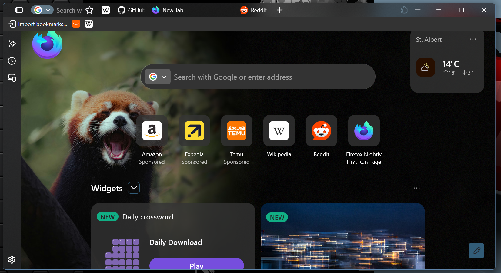

# FoxMica

A Firefox theme for Windows 11: the real Mica backdrop behind a one-line browser UI (tabs and URL bar in one row), with Explorer-style tabs. Built on [FoxOne](https://github.com/Firnschnee/FoxOne) by Firnschnee.

> **Work in progress.** Tested only on Firefox Nightly 159 on Windows 11, with the Nova redesign on (the default) and off. Other versions have not been tried yet.

## What you get

- **One-line layout** from FoxOne: tabs, URL bar and buttons share one row.
- **Mica** behind the tab strip and URL bar, the genuine Windows backdrop.
- **Two layers, like Explorer.** The top row is the plain Mica "strip". The selected tab, the bookmarks bar and the sidebar sit on a lighter "layer" above it.
- **Explorer-style tabs:** rounded top corners, flat inactive tabs, a filled selected tab, thin separators.
- **Bar height follows Firefox's UI density** (compact, normal, touch).
- **One settings file**, `foxone-config.css`, shared by the browser UI and the about: pages and new tab, so the two can't drift apart.
- **Nothing forced.** No `user.js`, no preference changes, no toolbar layout changes. You set the prefs below yourself.

## Requirements

- Windows 11. Mica does not exist on other systems.
- Firefox Nightly 159, see the note above.
- Transparency effects on: Windows Settings -> Personalization -> Colors.

## Install

1. Close Firefox completely.
2. Open your profile folder (`about:support`, the Profile Folder row).
3. Create a folder named `chrome` there if it doesn't exist.
4. Copy these **six files** into `chrome`. They load each other by name, so all six must be there:
   - `userChrome.css`
   - `userChrome-foxone.css`
   - `foxone-config.css`
   - `userChrome-tab-style.css`
   - `userChrome-foxone-overrides.css`
   - `userContent.css`
5. Set the prefs below in `about:config`.
6. Start Firefox.

## about:config prefs

| Pref | Value | Why |
|---|---|---|
| `toolkit.legacyUserProfileCustomizations.stylesheets` | `true` | Needed. Without it Firefox ignores everything in `chrome`. |
| `widget.windows.mica` | `true` | Needed. Turns on the Mica backdrop. |
| `widget.windows.mica.toplevel-backdrop` | `2` or `4` | Optional. `2` = Mica, `4` = Mica Alt. |
| `browser.tabs.allow_transparent_browser`, `browser.display.background_color` (and `.dark`) | `true`, `transparent` | Optional. Lets blank tabs show Mica too. Flaky on laptops with a discrete GPU. |
| `browser.compactmode.show` | `true` | Optional. Shows the Compact option under Customize -> Density. |

The dynamic bookmarks bar may also need the bookmarks toolbar set to "Always Show". Other FoxOne-style themes say so; I haven't confirmed it for this one yet.

## Settings

Everything you are meant to change is in `foxone-config.css`. It is variables only. The file's own comments explain each one; this is the short version.

| Setting | What it does |
|---|---|
| `--uc-color-base`, `-surface`, `-accent`, `-text`, `-hover` | The palette (dark). The `--uc-light-*` set is used when Firefox runs light. |
| `--uc-rounded`, `--uc-border-radius` | Rounded corners on or off, and how round. |
| `--ut-bar-height-compact / -normal / -touch` | Height of the one-line bar for each Firefox UI density. |
| `--ut-bar-padding` | Space above and below the tabs and URL field inside the bar. |
| `--ut-btn-inner-*`, `--ut-btn-outer` | Toolbar button padding, which sets how far apart the icons sit. |
| `--ut-tab-radius`, `--ut-tab-top-gap`, `--ut-tab-weight`, `--ut-tab-text` | Tab corner radius, gap above tabs, font weight, title colour. |
| `--ut-layer` | The colour and see-through-ness of the layer (selected tab, bookmarks bar, sidebar). Lighter grey or lower alpha = lighter tab. |
| `--ut-strip` | Optional tint for the top row. `transparent` = plain Mica. |
| `--ut-tab-hover-bg`, `--ut-separator` | Hover fill, and the thin lines between tabs (`transparent` = off). |
| `--ut-puzzle-color` | Colour of the extensions (puzzle) button icon. |
| `--ut-bookmarks-bg`, `--ut-bookmarks-height`, `--ut-bookmarks-inflow` | The bookmarks bar: fill while floating, height, and floating (`0`) or in-flow (`1`). |
| `--ut-drag-left` | Window-drag area left of the sidebar button when not maximized. `0` removes it. |
| `--ut-charms-on-hover`, `--ut-charm-delay` | Whether the URL-bar icons also appear on hover, and after what delay. Default: only when the bar is focused. |
| `--ut-hide-disabled-nav` | Hide a Back/Forward button that has nowhere to go (`0` off, `1` Forward only, `2` both). |
| `--ut-nav-delay` | Delay before hovering reveals the back/forward/reload buttons. |
| `--ut-pin-downloads` | Pin the Downloads button at the right edge (`1`) or leave it in the tab row (`0`). |

Further down the file are FoxOne's own settings with the values chosen here (URL bar width, tab widths, and so on). FoxOne's [customisation guide](https://firnschnee.github.io/FoxOne/customisation.html) documents those.

## Your own UI font (optional)

`userChrome.css` contains a switched-off block that sets a font for the browser interface. The instructions are in the comment above it. It only affects the browser UI; the about: pages are separate documents.

## Known issues

- The floating bookmarks bar only reveals when the pointer is over the URL bar, not the whole top row. That is how FoxOne works.
- Hovering Mica areas sometimes flickered during development on a laptop with NVIDIA and integrated graphics. It went away after reboots and driver updates, so it is probably a driver problem, but this isn't proven.
- Not tested yet: turning each feature off to check the theme degrades cleanly, other Firefox versions, and non-Windows systems.

## Contributing

Bug reports and ideas are welcome: please open an issue.
Want to send a pull request? Open an issue first and state your case.
I'll ask for the PR if it fits. This is a hobby project and I review
everything by hand, so unrequested PRs may sit or be closed.

Testers wanted: FoxMica has only been tried on one screen. Screenshots from other screen sizes and
Windows scale settings are very welcome, see [#23](https://github.com/snkiz/FoxMica/issues/23).

## Credits

- [FoxOne](https://github.com/Firnschnee/FoxOne) by Firnschnee (MIT). `userChrome-foxone.css` is FoxOne 3.8.7 exactly as released; `userContent.css` is FoxOne's with a few edits. FoxOne in turn credits [LittleFox](https://github.com/biglavis/LittleFox) and [Cascade](https://github.com/andreasgrafen/cascade).
- The Mica rules in `userChrome-foxone-overrides.css` are derived from [Wintego's Firefox-transparent-theme](https://github.com/Wintego/Firefox-transparent-theme).
- The look was matched by eye against Windows 11 Explorer and the MicaBar theme of Windhawk's [Windows 11 File Explorer Styler](https://windhawk.net/mods/windows-11-file-explorer-styler) mod (Windhawk is by [m417z](https://github.com/m417z)). No code from that project was used.
- Tab style: written by snkiz, with help from Claude (Anthropic).

## License

MIT, the same as FoxOne. See [LICENSE](LICENSE), which keeps FoxOne's copyright notice.
